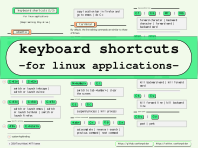
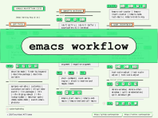
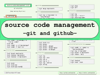

# About
`cheatsheets` repository pools all my cheetsheats mainly in linux environment.

Here, the cheatsheets:
1. [keyboard shortcuts for linux applications](pdf/cheatsheet-tony-aldon-keyboard-shortcuts-for-linux-applications.pdf)

2. [emacs workflow](pdf/cheatsheet-tony-aldon-emacs-workflow.pdf)

3. [source code management](pdf/cheatsheet-tony-aldon-source-code-management.pdf)

# Motivation 
* **Fact 1**: "I can't remember everything".
* **Fact 2**: "When you are working in an computer environment that use a
   lot of softwares that provide the rights stuff you need to perform
   your own given tasks, you need some reminder to do the tasks
   effectively."
* **Fact 3**: "You have to concentrate on getting things done, not how
      things are done."
* **Fact 4**: "Improve any kind of performance comes from every little
   things you do everyday."

# Get more

In some of the above cheatsheets, custom shortcuts are closely related to
my custom keyboard layout. If you're interested in, I would urge you
to have a look at [my keyboard layout.](https://github.com/tonyaldon/keyboard-layout)

# Contact

Do you have any question? Do you have any suggestion? Or, do you just
want to start a chat? Please, feel free to:
* leave me a message on twitter <a
href="http://www.twitter.com/tonyaldon">@tonyaldon</a> 
* or to email me at aldon.tony@gmail.com. 

Depend on my workflow, but I use to reply within 48 hours.

# Sharing

The more we share knowledge, the more we gain. If you think about a
friend who could be interested in this work, do not hesitate to let him know.

# License
Project under MIT license

**Remember the right things, reminder the others. Have a better life.**
